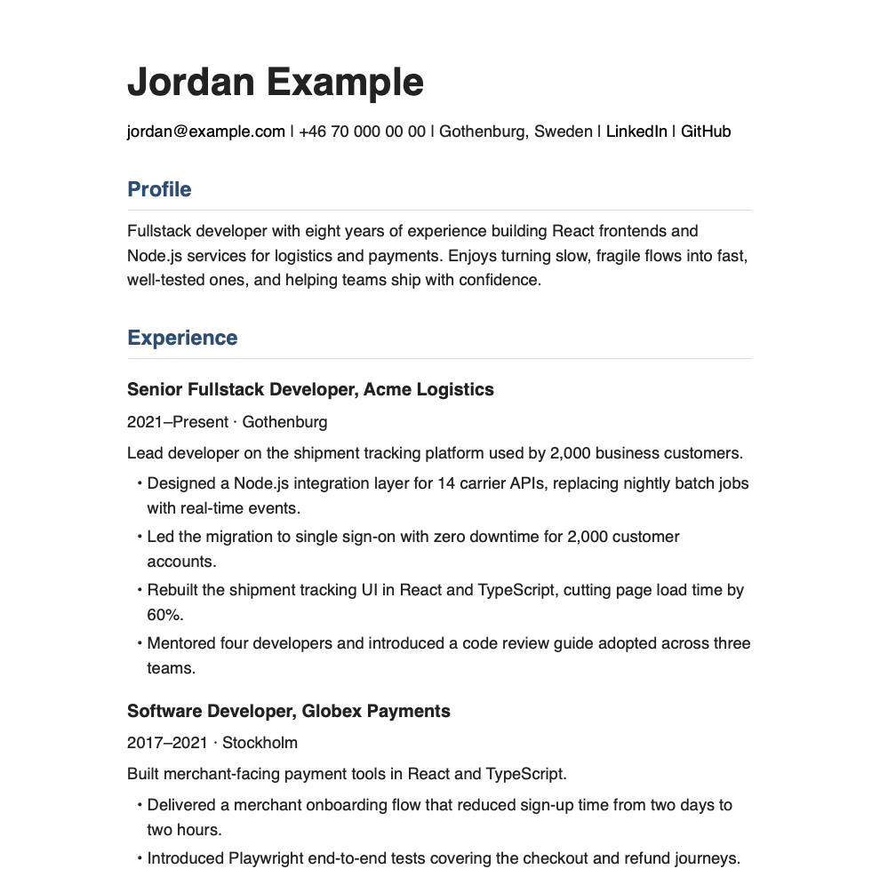

# Application Composer

[](https://github.com/lteyjolfur/application-composer-public/actions/workflows/ci.yml)
[](LICENSE)

A local, file-based CV and cover letter composer for software developer job applications.

The project is intentionally simple: YAML and Markdown source files, small Node.js scripts, and generated Markdown/HTML/PDF outputs. There is no UI, database, or cloud dependency.



*Example output, rendered from fictional sample data.*

## What It Is For

Use this repo to tailor applications quickly while keeping the underlying CV data easy to inspect and edit in VS Code. The included variants are reusable examples; choose, edit, or add variants that match your own background and target roles.

## Project Structure

- `data/profile/` - Base profile, education, languages, and contact data
- `data/experience/` - Work history
- `data/skills/` - Skills grouped for CV output
- `data/tags/` - Allowed tag list used by bullets, variants, and applications
- `data/bullet-bank/` - Reusable CV bullets
- `data/cv-variants/` - Variant configs such as frontend, fullstack, leadership, and test automation
- `data/cover-templates/` - Reusable cover letter templates
- `applications/` - Job-specific application folders
- `output/` - General variant CV output
- `scripts/` - Build, validation, scaffolding, and formatting logic
- `docs/` - README images
- `style.css` - CV HTML/PDF styling
- `cover.css` - Cover letter HTML/PDF styling

## Personalize This Repository

Before creating an application, replace all text marked `Example`, `Your`,
`Replace`, or `EXAMPLE` with your own factual information:

1. Add contact details, a professional summary, and languages in `data/profile/base-profile.yaml`.
2. Add education in `data/profile/education.yaml`.
3. Add work history in `data/experience/experience.yaml`.
4. Add your actual skills in `data/skills/skills.yaml`.
5. Replace the sample achievements in `data/bullet-bank/bullets.yaml`. Every bullet should be true and defensible in an interview.
6. Adapt the reusable text in `data/cover-templates/` and replace its angle-bracket placeholders when preparing a letter.
7. Review `data/cv-variants/` and `data/tags/tags.yaml` so selection reflects your target roles and experience.

Reusable candidate facts belong under `data/profile/`, `data/experience/`,
`data/skills/`, and `data/bullet-bank/`. Reusable wording and selection rules
belong under `data/cover-templates/` and `data/cv-variants/`. Each individual
job advertisement, its tailoring notes, and generated application documents
belong in a separate directory under `applications/`.

Install dependencies and verify your edits:

```sh
npm install
npm run validate
```

## Scripts

- `npm run validate` - Validate source data, tags, variants, and application folder structure
- `npm run lint` - Lint the scripts with ESLint
- `npm test` - Run the unit tests with Vitest (`npm run test:watch` to rerun on save)
- `npm run new-app -- --name <company-role-slug>` - Create a new application folder
- `npm run assemble -- --application <folder>` - Build a complete CV for an application
- `npm run assemble -- --variant <variant> [--tags a,b] [--exclude-tags c,d]` - Build a complete CV for a variant into `output/`
- `npm run build -- --variant <variant>` - Build a minimal bullet-only CV variant
- `npm run prepare-cover -- --application <folder> --template <template>` - Generate a cover letter from a template
- `npm run export -- --application <folder>` - Export the CV and cover letter to HTML and PDF

## Common Workflow

Create a new application:

```sh
npm run new-app -- --name example-role
```

Then:

1. Paste the job ad into `applications/example-role/job-ad.md`.
2. Add any notes or research to `applications/example-role/notes.md`.
3. Edit `applications/example-role/selected-tags.yaml`.
4. Build the CV:

```sh
npm run assemble -- --application example-role
```

5. Generate a cover letter:

```sh
npm run prepare-cover -- --application example-role --template frontend
```

6. Review and manually edit `cv.md` and `cover-letter.md`.
7. Export to HTML and PDF:

```sh
npm run export -- --application example-role
```

## Application Folders

Each folder under `applications/` is one job application.

Source files:

- `job-ad.md` - Pasted job ad for traceability
- `notes.md` - Research, recruiter notes, interview prep, or tailoring notes
- `selected-tags.yaml` - Variant and extra tag selection
- `cv.md` - Generated or edited CV Markdown
- `cover-letter.md` - Generated or edited cover letter Markdown

Generated export files may also exist in application folders, usually as `.html` and `.pdf`.

Application folders other than `applications/test-app/` are gitignored because
they contain personal data, and so are generated `.html` and `.pdf` exports.

Example:

```text
applications/
  example-company-example-role/
    job-ad.md
    notes.md
    selected-tags.yaml
    cv.md
    cover-letter.md
    Your_Name_Example_Company_Example_Role_CV.html
    Your_Name_Example_Company_Example_Role_CV.pdf
```

Example `selected-tags.yaml`:

```yaml
company: Example Company   # fills <COMPANY> in the cover letter
role: Frontend Developer   # fills <ROLE> in the cover letter
variant: fullstack
tags:            # added to the variant's include_tags
  - authentication
exclude_tags:    # added to the variant's exclude_tags
  - payments
```

- `tags` makes more bullets eligible for this application.
- `exclude_tags` drops every bullet carrying one of these tags, even if it
  matches the variant. Use it to tailor one application without editing a
  shared variant, for example to leave out payments work when applying to a
  payments competitor.
- A tag cannot be in both lists; `npm run validate` reports it.

If both `--application` and `--variant` are passed to `assemble` or `build`, the application config wins.

## CV Variants

Variants live in `data/cv-variants/*.yaml`.

Each variant has:

- `variant` - The CLI name, such as `frontend`, `fullstack`, `leadership`, or `testautomation`
- `include_tags` - Tags used to select bullets
- `exclude_tags` - Tags that disqualify matching bullets

Example:

```yaml
variant: frontend
include_tags:
  - frontend
  - react
  - performance
  - reliability
exclude_tags: []
```

## Bullet Bank

Reusable bullets live in `data/bullet-bank/bullets.yaml`.

Each bullet should have:

- `id` - Stable unique identifier
- `text` - CV bullet text
- `tags` - Selection tags
- `section` - Optional section, usually `experience`, `impact`, or `leadership`

Example:

```yaml
- id: example-frontend-performance
  text: >
    [EXAMPLE — replace or remove] Describe a frontend improvement and its measurable result.
  tags:
    - frontend
    - react
    - performance
    - reliability
```

All tags used by bullets, variants, or applications must be declared in `data/tags/tags.yaml`.

## Bullet Selection

The selection logic is in `scripts/lib/selection.js`. It is intentionally
simple and inspectable: improve bullet quality and tags before adding more
selection logic.

### How bullets are chosen

1. **Effective tags** are the variant's `include_tags` plus the application's
   `tags` (or `--tags` on the command line). **Excluded tags** are the variant's
   `exclude_tags` plus the application's `exclude_tags` (or `--exclude-tags`).
   Excluded tags are also removed from the effective tags (`resolveTags`).
2. **Scoring:** each bullet scores the sum of its matching tags. Most tags are
   worth 1; `integration`, `backend`, `authentication`, and `payments` are worth 2
   (`TAG_WEIGHTS`). Bullets scoring 0, and bullets carrying any excluded tag,
   are dropped.
3. **Ordering:** highest score first; ties keep their order in `bullets.yaml`.
4. **Section quotas (first pass):** at most 2 `experience`, 1 `impact`, and
   1 `leadership` bullet (`SECTION_LIMITS`). A bullet without `section` counts
   as `experience`.
5. **Fill (second pass):** if fewer than 4 bullets (`MAX_BULLETS`) were picked,
   the remaining slots are filled by score, ignoring quotas.
6. **Duplicates** are skipped in both passes (see below).

`section` only affects quotas in `assemble`; the full CV lists the chosen
bullets in the order they were picked. `build` groups them under section
headings.

### Where selected bullets appear

`assemble` places the selected bullet-bank bullets under the **first entry in
`data/experience/experience.yaml` only** (your current or most recent role).
Every other entry shows its own static `bullets` list instead:

```yaml
- role: Senior Developer        # first entry: gets bullet-bank bullets
  company: Current Company
- role: Developer               # older entries: use their static bullets
  company: Previous Company
  bullets:
    - Delivered a merchant onboarding flow that reduced sign-up time from two days to two hours.
```

Consequences to plan around:

- Bullet-bank bullets are not linked to an employer, so they are always
  presented as achievements in your first role. Keep older-role achievements
  as static `bullets` on that entry, not in the bullet bank.
- Static `bullets` on the **first** entry are ignored, even when no bullet-bank
  bullet matched. If an application selects nothing, the first role shows only
  its summary.
- Older roles are not tailored per application; their static bullets appear
  in every CV.

### Duplicate detection

Before a bullet is added, its text is normalized (lowercased, punctuation
removed, whitespace collapsed) and compared with each already-selected
bullet. It is skipped when either normalized text **contains** the other.

- Caught: identical bullets, and a short bullet that is a prefix or excerpt of
  a longer one ("Rebuilt the tracking UI in React." vs "Rebuilt the tracking
  UI in React, cutting load time by 60%.").
- Not caught: reworded bullets about the same achievement ("Cut page load time
  by 60%" vs "Reduced page load by 60%"). Avoid these by giving each
  achievement one bullet in the bank and varying it with tags, not copies.

The higher-scoring bullet wins, since bullets are checked in score order.

## Cover Letters

Cover templates live in `data/cover-templates/`.

Available templates include:

- `base`
- `frontend`
- `fullstack`
- `leadership`
- `test-automation`

Generate a cover letter:

```sh
npm run prepare-cover -- --application example-role --template frontend
```

The script prepends the profile header and refuses to overwrite a cover letter that already has real content.

Templates are short English skeletons. `prepare-cover` fills `<COMPANY>` and
`<ROLE>` from the application's `selected-tags.yaml` and `<YOUR_NAME>` from
your profile. Placeholders without a value, such as `<COMPANY_MOTIVATION>`,
stay in place: replace each with text specific to the job; to write in another language, translate the
templates once and keep the placeholders.

`assemble --application` also writes a cover letter if none exists yet,
picking the template from the variant name (`testautomation`, `leadership`,
`fullstack`, `frontend`), then from the tags, falling back to `base`.

## Validation

Run:

```sh
npm run validate
```

Validation checks:

- Required source files exist
- YAML parses correctly
- Bullet IDs are present and unique
- Bullet text and tags are valid, and `section` is `experience`, `impact`, or `leadership`
- Variants have valid, unique names and include tags
- Application folders contain required files
- Application selected variants exist, and no tag is in both an application's `tags` and `exclude_tags`
- Tags used by bullets, variants, and applications exist in `data/tags/tags.yaml`
- Profile, experience, and skills have the required shape

Generated `.html` and `.pdf` exports are allowed alongside the core source files in application folders.

## Exporting HTML And PDF

`npm run export` converts the Markdown to HTML with Pandoc and then to PDF with
WeasyPrint. Install both first; on macOS:

```sh
brew install pandoc weasyprint
```

Export an application's CV and cover letter:

```sh
npm run export -- --application example-role
```

Options:

- `--only cv` or `--only cover` - export just one document
- `--variant <variant>` instead of `--application` - export `output/<variant>.md`

Files are written next to the Markdown, named
`<Your_Name>_<Application>_CV.pdf` and `<Your_Name>_<Application>_Cover_Letter.pdf`
(plus the intermediate `.html`). The CV uses `style.css`; the cover letter adds
`cover.css`. `assemble` and `prepare-cover` print the export command to run next.

## Troubleshooting

If `npm run export` says `pandoc` or `weasyprint` is not installed:

- Install it (see "Exporting HTML And PDF") and check it runs from your shell.

If the PDF looks unstyled:

- Export with `npm run export` rather than running Pandoc by hand; it computes the stylesheet paths.
- The generated HTML should link `../../style.css` (and `../../cover.css` for cover letters).

If a script reports `Invalid application name` (or variant or template name):

- Pass only the folder or file name, such as `--application example-role`, not a
  path like `applications/example-role` or `../example-role`.

If validation reports unknown tags:

- Add the tag to `data/tags/tags.yaml`, or replace it with an existing tag.
- Keep tags simple and selection-oriented.

## Maintenance Notes

- Keep all data local and file-based.
- Keep source data easy to read and edit manually.
- Prefer explicit files over clever abstractions.
- Do not replace validation with a success-only stub.
- Every bullet should be defensible in an interview.
- Improve content quality before adding more automation.

## Commits And Versioning

Commit messages follow [Conventional Commits](https://www.conventionalcommits.org/):

```text
<type>(<optional scope>): <summary in imperative mood>
```

| Type | Use for | Version bump |
| --- | --- | --- |
| `feat` | New behavior a user of the scripts can see | minor |
| `fix` | A bug fix | patch |
| `docs` | README, AGENTS.md, comments only | none |
| `refactor` | Code change with no behavior change | none |
| `test` | Adding or changing tests | none |
| `ci` | `.github/workflows/` | none |
| `chore` | Dependencies, config, housekeeping | none |

Mark a breaking change with `!` after the type (`feat!: ...`) and a
`BREAKING CHANGE:` footer explaining what users must change. Common scopes are
`cli`, `validate`, `selection`, `assemble`, `cover`, and `data`.

Examples:

```text
feat(selection): add per-application exclude_tags
fix(cli): reject application names that leave applications/
docs: explain where selected bullets appear
```

The version in `package.json` follows [Semantic Versioning](https://semver.org/).
While it is `0.x`, the command-line interface and data formats may still change;
a breaking change bumps the minor version instead of the major.

## Next Improvements

- Expand the bullet bank for frontend, fullstack, leadership, and test automation variants.
- Tune scoring and section limits only after the source bullets are strong.
- Add optional pinned bullets per variant or application if manual control becomes too repetitive.
